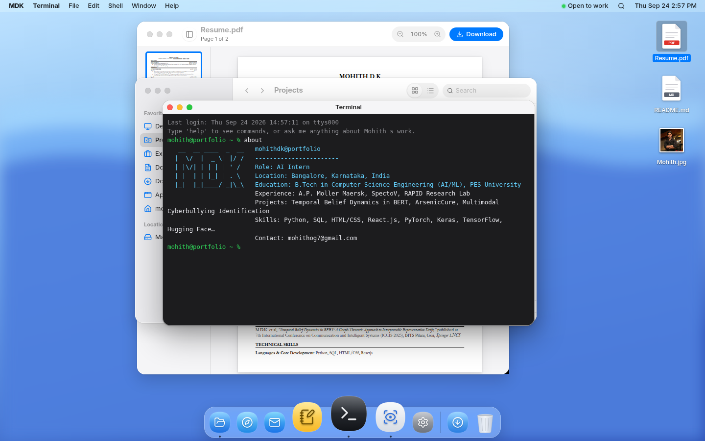

# Mohith D K — Portfolio

A browser recreation of a Mac, where my resume and projects live as real files, folders and apps. Phones get an iOS-style home screen instead. Everything is built from `content/`, which comes from my resume.



- **Recruiters:** `Resume.pdf` is on the desktop (double-click it), or open the [simple version](/simple).
- **Engineers:** open Finder → Projects, press `⌘K` for Spotlight, or open Terminal and type `help` or ask a question.

Not affiliated with Apple Inc. No Apple fonts, icons, wallpapers or logos are used.

## Stack

Next.js 16 (App Router) · TypeScript · Tailwind CSS v4 · Motion · Zustand · MDX · Vercel AI SDK + Anthropic · Upstash Redis (Vercel Marketplace) · Resend · Cloudflare Turnstile · react-pdf · Vitest · Playwright · pnpm.

## Develop

```bash
pnpm install
cp .env.example .env.local   # all variables are optional for local development
pnpm dev                     # http://localhost:3000
```

| Command | What it does |
|---|---|
| `pnpm lint` | ESLint |
| `pnpm typecheck` | Validates content, then `tsc --noEmit` |
| `pnpm test` | Validates content, then the Vitest unit tests |
| `pnpm build && pnpm test:e2e` | Playwright end-to-end tests against `pnpm start` |
| `SCREENSHOTS=1 pnpm test:e2e screenshots --project desktop` | Regenerates `docs/screenshots/` |
| `node scripts/build-icons.ts` | Regenerates the original icons and wallpapers |

## Editing content

Everything about me lives in `content/`:

- `profile.json`: name, title, contact, links, education, publications, achievements, availability.
- `skills.json`: skill categories and the About This Mac spec rows.
- `projects/`, `experience/`, `notes/`: an `index.json` with metadata, plus one `.mdx` per item.
- `docs/`: loose documents (desktop README, certificates, keyboard shortcuts).
- `filesystem.json`: the virtual Mac file tree; `source` points into `content/` or `public/`.

`pnpm content` (which runs automatically before dev, build, typecheck and tests) validates all of this and fails with a readable error. `PLAN.md` lists open questions and `TODO(owner)` items.

## Environment variables

Set these in **Vercel → Project → Settings → Environment Variables**. Without them the site still works: the agent shows a "not switched on" message, the contact form offers a `mailto:` link, and rate limits fall back to in-memory.

| Variable | Used by | Notes |
|---|---|---|
| `NEXT_PUBLIC_SITE_URL` | Metadata, sitemap, OG | Defaults to Vercel's production URL |
| `ANTHROPIC_API_KEY` | `/api/agent` | Required for the Terminal/Messages agent |
| `AGENT_MODEL` | `/api/agent` | Optional, default `claude-haiku-4-5` |
| `KV_REST_API_URL`, `KV_REST_API_TOKEN` | Rate limits, Activity Monitor | Added automatically when you connect **Upstash for Redis** from the Vercel Marketplace (Storage tab). `UPSTASH_REDIS_REST_URL` / `UPSTASH_REDIS_REST_TOKEN` also work |
| `RESEND_API_KEY`, `CONTACT_FROM_EMAIL` | `/api/contact` | `CONTACT_FROM_EMAIL` must use a domain verified in Resend |
| `CONTACT_TO_EMAIL` | `/api/contact` | Optional; defaults to the email in `profile.json` |
| `NEXT_PUBLIC_TURNSTILE_SITE_KEY`, `TURNSTILE_SECRET_KEY` | Contact form | Cloudflare Turnstile. Set both or neither |

## Deploy on Vercel

1. Import the repository in Vercel. It auto-detects the framework preset (Next.js), install command (`pnpm install`) and build command (`pnpm build`).
2. Connect Upstash for Redis from the Marketplace and add the other variables above.
3. Deploy. `/sitemap.xml`, `/robots.txt` and the OG images at `/og/<slug>` are generated automatically.

## Routes

- `/`: the desktop (macOS on desktop and tablet, iOS on phones).
- `/simple`: the whole portfolio as plain, accessible HTML.
- `/projects/<slug>`, `/experience/<slug>`: shareable deep links. They serve real HTML for crawlers, then open the item in Finder and TextEdit.
- `/api/agent`, `/api/contact`, `/api/stats`: backend.
